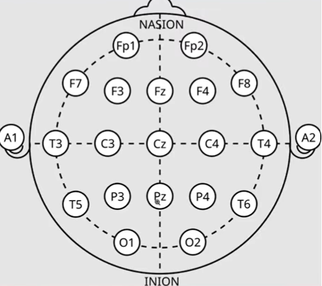

# Project2_EEG_Sleep_stages_prediction

Predict different stages of sleep from EEG data. EEG is electroencephalogram - it is used to record the electrical activity of the brain by placing small electrodes on the scalp. 

## DATASET
We use the sleep EDF database here which contains 197 whole night sleep recordings. For each subject in the data, we have two types of files- one is the PSG files and the other is Hypogram files. The PSG files contain 7 channels of time series data. 2 of these channels are EEG data which we are going to use. The hypnogram files contain ground truths i.e., actual sleep stage during specific time spans in the data.

The raw sleep recordings in PSG files contain EEG (electrodes: Fpz-Cz and Pz-Oz), EOG (horizontal eye movement), Chin EMG, Event marker, (Sleep Cassette files also include respiration and body temperature). Hypnogram files contain sleep stage annotations scored as: W (wake), R (REM), 1-4 (NREM or Non Rapid Eye Movement), M (movemnent), ? (uncensored).

How the signals were sampled? Different signals were sampled at different rates. EEG and EOG at 100 times per second i.e., 100 Hz. Since these signals change rapidly, high frequency sampling is needed to capture them accurately. EMG, respiration, temeprature, and event market at once per second. Since these signals change super slow, once per second is enough. 

### LOADING DATASET
Use mne to to load time series data (psg data). Bipolar montages are EEG recording configurations in which each channel represents the voltage difference between two adjacent scalp electrodes. The two eeg channels we want are EEG Fpz-Cz and EEG Pz-Oz: these are bipolar montages. 

## DATA PREPARATION
We load for each subject the PSGfile, the hypnogram. We load the first EEG channel then the annotations. Similarly, we do this for the second EEG channel. We then create a dictionary for mapping strings like Sleep stage W, Sleep stage 1, Sleep stage 2, Sleep stage 3, Sleep stage 4 and Sleep stage R to numbers 0, 1, 2, 3, 4 and 5. Then iterate over the label time segments and craft 30 second windows that we add as training data w/ respective classification. 

Check number of instances for each sleep stage > prepare data for neural n/w using normalization and train test split > stratify for y because we want equal distribution of classes during splitting.

## MODEL TRAINING: DEFINE CONVOLUTIONAL NEURAL NETWORKS
Define 1 d convolutional layers since we're working with time series not images. Convolutional layer > ReLU as activation > Max pooling. Then repeat and finally flatten for NN. Create fully connected layer > ReLU activation function > Use dropout for regularization - to drop out 50 percent of neurons for better generalization > another fcl which outputs six neurons (waking state, rem state, 4 sleep stages).

Define loss function as cross entropy loss and optimizer as Adam to optimize model parameters. Start model training: for each epoch, create batches for features and target, reset the gradients to 0, get model output for given input, calculate loss using cross entropy loss, backpropagate loss, take a step with optimizer in right direction.

## MODEL EVALUATION
Evaluate model on unseen data. Disable gradient calculation because we're not doing training. Get predictions for test set, calculate the max arg from the predictions and find accuracy. Confusion matrix can also be found to see where the classification model is getting confused. It shows the no of correct and incorrect preds made by model broken down by class. 

